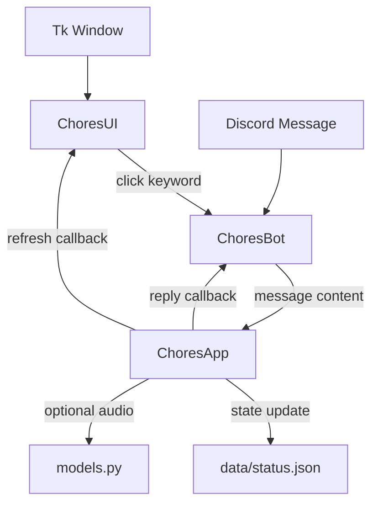

# Chores App Overview

## Purpose

This app runs a family chores board with a Tkinter display, Discord message handling, persistent chore assignment state, and optional silly audio announcements.

Always use `make test` for the regular automated test suite. Do not use `uv run pytest` directly for normal validation because manual tests may involve paid services, audio hardware, or external integrations.

## Basic Functionality

The app tracks three chores:

- Dishwasher
- Kitchen trash
- Wednesday trash

Each chore stores an integer assignment index into `ChoresApp.chore_people`. When a chore is marked done, the app advances that chore to the next person, persists the updated state, optionally sends a Discord reply, optionally plays an audio announcement, and refreshes the UI.

Users can mark chores done by clicking the Tkinter UI or by sending Discord messages containing chore keywords. Status messages return the current assignment for all chores.

## Runtime Architecture

`chores.py` is the entry point. It creates the Tk window, constructs the app, UI, and Discord bot, then wires callbacks between them.

## Core Abstractions

`ChoresState` is an immutable dataclass containing the three assignment indexes. It is serialized to `data/status.json`.

`ChoresApp` owns the application state and business logic. It loads and saves state, rotates assignments, routes messages, and invokes callbacks for Discord replies and UI refreshes.

`ChoresUI` owns the Tkinter view. It renders chore labels, person images, the clock, and the audio toggle. Clicking a chore image schedules the matching app message on the Discord bot event loop.

`ChoresBot` owns Discord integration. It listens for incoming Discord messages, forwards message text to `ChoresApp`, sends replies to the last known channel, and runs a UI refresh loop.

`models.py` owns audio generation and playback. It asks OpenAI for short announcement text and uses ElevenLabs to generate and play speech audio.

## Testing Policy

Automated tests must not call OpenAI, ElevenLabs, audio playback, or other paid server-side services. They may test Discord login or read-only behavior if needed, but they must not write to Discord.

Manual tests are explicit one-case entry points. The current manual audio smoke test is run with `make test-audio`; it may call OpenAI, ElevenLabs, and the host's default speakers.
